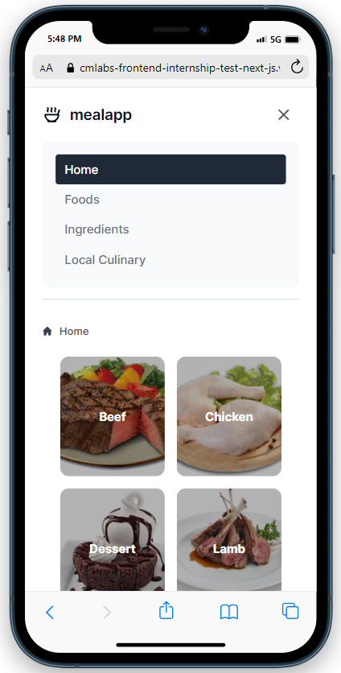

## Requirements

- NPM version 10.1.0
- NODE JS version v20.9.0

## Demo

https://cmlabs-frontend-internship-test-next-js.vercel.app/

## Screenshot Desktop


## Screenshot Mobile



## Instalation

Buka terminal cmd lalu ketik dan jalankan

```bash
  git clone https://github.com/aguspranyoto/cmlabs-frontend-internship-test-next-js.git
```

## Usage

1. Buka folder cmlabs-frontend-internship-test-next-js

2. Buka terminal cmd di dalam folder cmlabs-frontend-internship-test-next-js

3. Ketik dan jalankan pada terminal cmd

```bash
  npm install
```

4. Ketik dan jalankan pada terminal cmd

```bash
  npm run dev
```

5. Kunjungi link berikut http://localhost:3000

## Contact

LinkedIn : https://www.linkedin.com/in/aguspranyoto/

Website Portfolio: https://agus-pranyoto.web.app/

[HTML]: https://img.shields.io/badge/-HTML-orange
[TAILWIND]: https://img.shields.io/badge/-TAILWIND-blue
[JS]: https://img.shields.io/badge/-JS-yellow
[JQUERY]: https://img.shields.io/badge/-JQUERY-orange
[NEXTJS]: https://img.shields.io/badge/-NEXTJS-orange
[AJAX]: https://img.shields.io/badge/-AJAX-blue
[REACT]: https://img.shields.io/badge/-REACT-yellow
[TYPESCRIPT]: https://img.shields.io/badge/-TYPESCRIPT-orange
